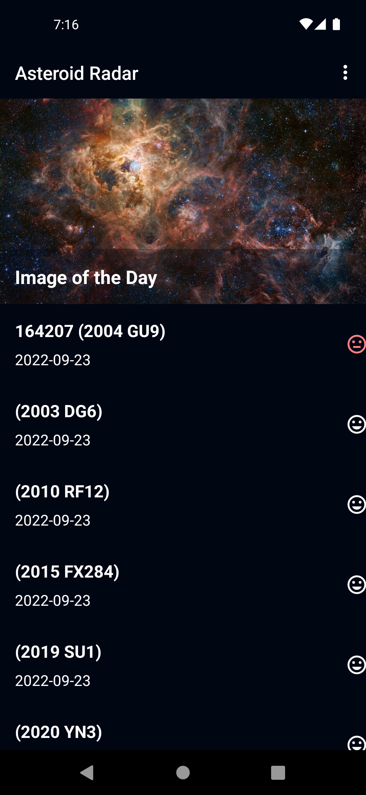
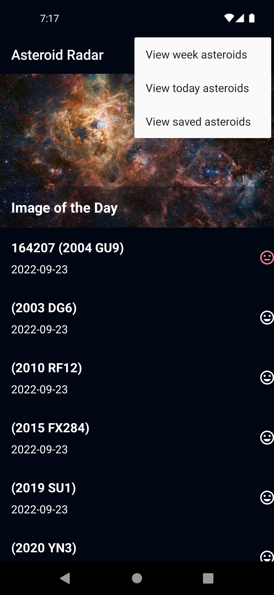
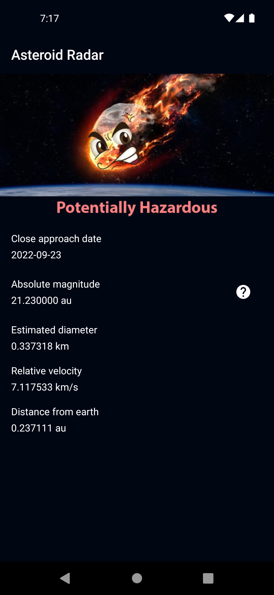
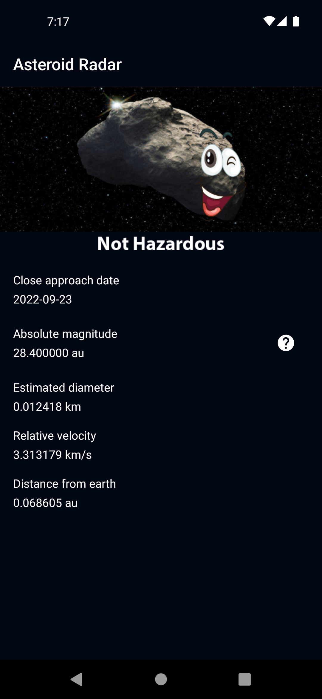

# Asteroid Radar
Asteroid Radar is an app that showcases how close are the closest asteroids to Earth. The app uses the NASA API for the list of asterods.
This  is a project for the Udacity Android kotlin Nanodegree Program.

## Technologies
- MVVM Architecture
- RecyclerView
- Navigation Component
- ViewModel
- LiveData
- Room
- Databinding
- Coroutines
- Material Design Component

## Prerequisite
To build this project, you require:
- Android Studio artic fox
- Gradle 7.0.4

## Screenshots
<h4 align="center">

## Author
Mahmoud Ibrahim

## License
This project is licensed under the Apache License 2.0 - See: http://www.apache.org/licenses/LICENSE-2.0.txt

